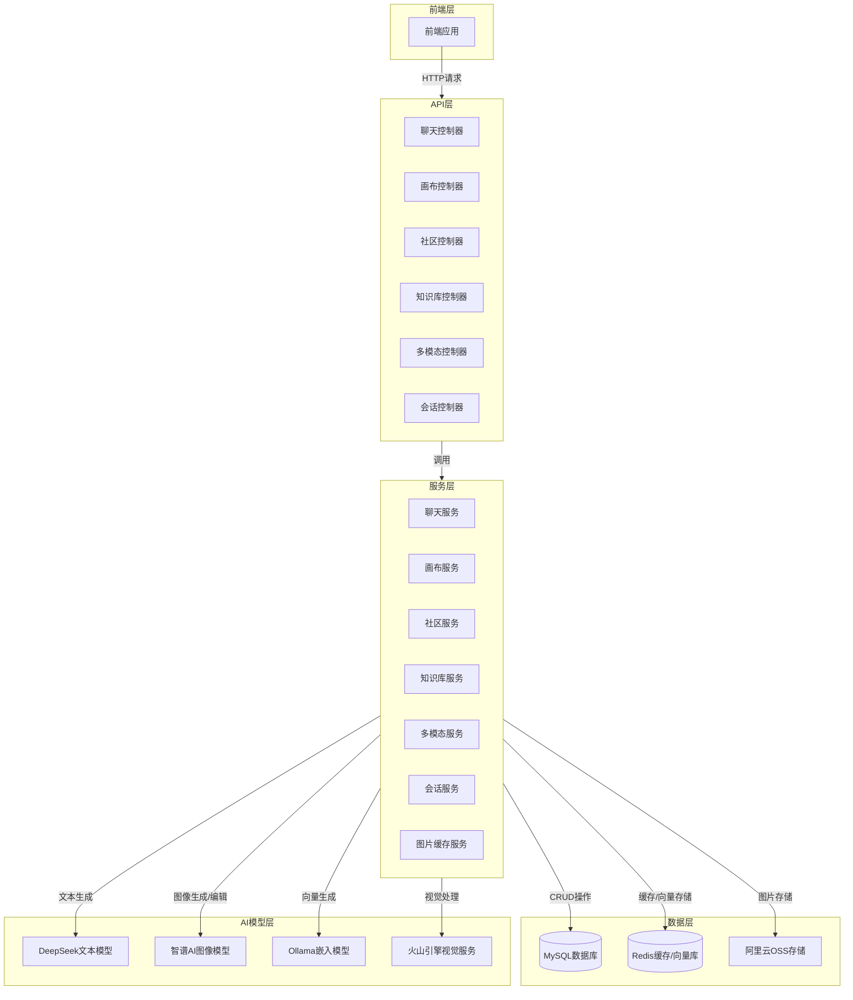
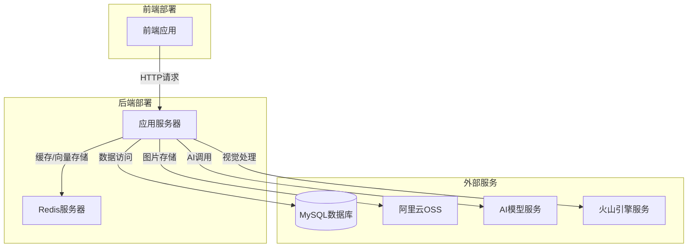

# ChatClient 项目架构功能设计文档

## 1. 项目概述

### 1.1 项目背景
随着人工智能技术的快速发展，智能对话、图像生成与编辑等功能逐渐成为应用开发的重要方向。本项目旨在构建一个集成多种AI能力的智能聊天客户端，提供丰富的交互功能和用户体验。

### 1.2 项目目标
- 提供基于AI模型的智能对话功能
- 支持图片的生成、编辑和处理
- 构建用户社区，实现图片分享与互动
- 整合知识库管理，实现文档解析和相似性搜索
- 支持多模态输入输出，提升用户交互体验

### 1.3 核心功能
- **AI聊天**：基于DeepSeek模型的智能对话
- **画布功能**：图片编辑、组合、迁移、替换和衍生
- **社区互动**：图片发布、评论、点赞和收藏
- **知识库管理**：文档解析和相似性搜索
- **多模态处理**：支持文本、图像等多种输入输出形式
- **会话管理**：用户会话的创建、查询和管理

## 2. 技术架构设计

### 2.1 技术栈选择

| 类别 | 技术/框架 | 版本 | 选型理由 |
|------|-----------|------|----------|
| 基础框架 | Spring Boot | 3.5.9 | 提供快速开发、自动配置和内嵌服务器，简化应用部署 |
| 开发语言 | Java | 17 | 成熟稳定，生态丰富，适合企业级应用开发 |
| 持久层 | MyBatis | 3.0.5 | 灵活的SQL映射，支持定制化查询，适合复杂业务场景 |
| 数据库 | MySQL | - | 关系型数据库，稳定可靠，适合结构化数据存储 |
| AI框架 | Spring AI | 1.0.0 | 统一的AI模型接口，简化AI能力集成 |
| 文本模型 | DeepSeek | - | 高性能的中文对话模型，适合智能聊天场景 |
| 图像模型 | 智谱AI | - | 强大的图像生成和编辑能力 |
| 嵌入模型 | Ollama | - | 本地部署的嵌入模型，适合向量生成 |
| 向量存储 | Redis | - | 高性能的内存数据库，适合向量存储和相似性搜索 |
| 对象存储 | 阿里云OSS | 3.18.4 | 可靠的云存储服务，适合图片等大文件存储 |
| 安全认证 | JWT | 0.9.1 | 无状态认证，便于水平扩展 |
| 工具库 | Lombok | - | 减少样板代码，提高开发效率 |
| 文档处理 | Apache POI | 5.2.4 | 支持Word、Excel等文档解析 |
| PDF处理 | PDFBox | 2.0.29 | 支持PDF文档解析 |

### 2.2 系统架构图

### 2.3 系统分层设计

| 层次 | 职责 | 核心组件 | 技术实现 |
|------|------|----------|----------|
| 前端层 | 用户交互界面 | 前端应用 | 前端框架（如Vue、React等） |
| API层 | 请求接收与响应 | 各模块控制器 | Spring MVC |
| 服务层 | 业务逻辑处理 | 各模块服务 | Spring Service |
| 数据层 | 数据存储与访问 | 数据库、缓存、对象存储 | MySQL、Redis、阿里云OSS |
| AI模型层 | AI能力提供 | 文本、图像、嵌入模型 | DeepSeek、智谱AI、Ollama、火山引擎 |

## 3. 功能模块设计

### 3.1 聊天模块

#### 3.1.1 功能描述
- 提供基于AI模型的智能对话功能
- 支持聊天历史记录的存储和查询
- 与会话管理模块集成，维护用户会话

#### 3.1.2 核心流程
1. 前端发送聊天请求（包含用户输入、会话ID等）
2. 控制器接收请求并调用ChatService
3. ChatService调用DeepSeek模型生成回复
4. 保存聊天记录到数据库
5. 返回回复给前端

#### 3.1.3 关键类与方法
- `ChatController.chatPost()`：处理聊天请求，返回流式响应
- `ChatService.chatPost()`：调用AI模型生成回复
- `ChatService.chatMsg()`：查询聊天历史记录

### 3.2 画布模块

#### 3.2.1 功能描述
- 支持图片的编辑、组合、迁移、替换和衍生
- 提供画布会话管理，保存用户的编辑历史
- 与阿里云OSS集成，存储处理后的图片

#### 3.2.2 核心流程
1. 前端发送图片编辑请求（包含图片URL、编辑提示词等）
2. 控制器接收请求并调用CanvasService
3. CanvasService调用火山引擎视觉服务处理图片
4. 将处理后的图片上传到阿里云OSS
5. 保存图片信息到数据库
6. 返回处理后的图片URL给前端

#### 3.2.3 关键类与方法
- `CanvasServiceImpl.inpainting()`：处理图片编辑请求
- `CanvasServiceImpl.cvProcess()`：调用火山引擎视觉服务
- `CanvasServiceImpl.sessionCreate()`：创建画布会话
- `CanvasServiceImpl.saveImage()`：保存图片信息

### 3.3 社区模块

#### 3.3.1 功能描述
- 支持用户发布图片到社区
- 提供评论、点赞和收藏功能
- 实现敏感词过滤，确保内容健康

#### 3.3.2 核心流程
1. 用户上传图片并发布到社区
2. 系统检测图片内容，过滤敏感词
3. 其他用户可以查看、评论、点赞和收藏图片
4. 系统记录互动数据并更新到数据库

#### 3.3.3 关键类与方法
- `ImagepostController`：处理图片发布请求
- `ImageCommentController`：处理评论相关请求
- `SensitiveWordController`：管理敏感词

### 3.4 知识库模块

#### 3.4.1 功能描述
- 支持PDF、Word等文档的解析
- 将文档内容向量化并存储到Redis
- 提供基于向量相似度的搜索功能

#### 3.4.2 核心流程
1. 用户上传文档到知识库
2. 系统解析文档内容
3. 使用Ollama模型生成文本嵌入向量
4. 将向量存储到Redis
5. 用户可以通过关键词搜索相关文档内容

#### 3.4.3 关键类与方法
- `KnowledgeBaseController`：处理知识库相关请求
- `KnowledgeBaseService`：处理文档解析和向量生成
- `SimilaritySearchService`：实现相似性搜索

### 3.5 多模态模块

#### 3.5.1 功能描述
- 支持文本、图像等多种形式的输入
- 实现意图识别，理解用户需求
- 生成相应的文本或图像输出

#### 3.5.2 核心流程
1. 用户输入文本和/或图像
2. 系统识别用户意图
3. 根据意图调用相应的AI模型
4. 生成多模态响应
5. 返回响应给用户

#### 3.5.3 关键类与方法
- `MultiModalController`：处理多模态请求
- `MultiModalService`：处理多模态输入输出
- `IntentRecognitionService`：识别用户意图

### 3.6 会话模块

#### 3.6.1 功能描述
- 管理用户的聊天会话
- 支持会话的创建、查询和删除
- 与聊天模块集成，维护会话上下文

#### 3.6.2 核心流程
1. 用户开始新的聊天时创建会话
2. 系统保存会话信息到数据库
3. 用户可以查询历史会话列表
4. 用户可以选择历史会话继续聊天

#### 3.6.3 关键类与方法
- `SessionController`：处理会话相关请求
- `SessionService.create()`：创建会话
- `SessionService`：管理会话信息

## 4. 数据模型设计

### 4.1 核心数据实体

| 实体名称 | 说明 | 主要字段 | 关联关系 |
|----------|------|----------|----------|
| ChatSqlmsg | 聊天消息 | id, uid, sessionid, content, role, create_time | 与Session关联 |
| CanvasImage | 画布图片 | id, session_id, image_url, created_at, updated_at | 与SessionInfo关联 |
| SessionInfo | 画布会话 | session_id, user_id, text, created_at, updated_at | 与CanvasImage关联 |
| Imagepost | 社区图片 | id, user_id, image_url, content, created_at, updated_at | 与ImageComment、ImageLike关联 |
| ImageComment | 图片评论 | id, image_id, user_id, content, created_at | 与Imagepost关联 |
| ImageLike | 图片点赞 | id, image_id, user_id, created_at | 与Imagepost关联 |
| KnowledgeBase | 知识库 | id, name, content, vector, created_at | - |
| MultiModalResult | 多模态结果 | id, input_type, input_content, output_type, output_content, created_at | - |
| Session | 聊天会话 | id, user_id, session_id, created_at, updated_at | 与ChatSqlmsg关联 |

### 4.2 数据存储方案

| 存储类型 | 用途 | 技术实现 | 配置 |
|----------|------|----------|------|
| 关系型数据 | 业务数据存储 | MySQL | 连接池配置：最大连接数30，最小空闲10 |
| 缓存数据 | 热点数据缓存 | Redis | 地址：localhost:6380 |
| 向量数据 | 知识库向量存储 | Redis | 与缓存共用Redis实例 |
| 图片存储 | 图片文件存储 | 阿里云OSS | 桶名：image-ai-oss，区域：cn-beijing |

## 5. 接口设计

### 5.1 聊天模块接口

| 接口路径 | 方法 | 功能描述 | 请求参数 | 响应数据 |
|----------|------|----------|----------|----------|
| /ai/chat | POST | AI对话聊天 | ChatMsg对象（包含message、sessionId等） | 流式文本响应 |
| /ai/c_msg | GET | 获取聊天记录 | uid（用户ID）, sessionid（会话ID） | 聊天消息列表 |

### 5.2 画布模块接口

| 接口路径 | 方法 | 功能描述 | 请求参数 | 响应数据 |
|----------|------|----------|----------|----------|
| /canvas/inpainting | POST | 图片编辑 | CanvasImage对象（包含imageUrl、prompt等） | 处理后的图片URL列表 |
| /canvas/session/list | GET | 获取画布会话列表 | userId（用户ID） | 会话信息列表 |
| /canvas/session/image | GET | 获取会话图片列表 | sessionId（会话ID） | 图片URL列表 |
| /canvas/session/create | POST | 创建画布会话 | SessionInfo对象（包含text、imageBase64等） | 创建的会话信息 |
| /canvas/save/image | POST | 保存图片信息 | SessionInfo对象（包含sessionId、imageBase64等） | 保存的图片URL列表 |

### 5.3 社区模块接口

| 接口路径 | 方法 | 功能描述 | 请求参数 | 响应数据 |
|----------|------|----------|----------|----------|
| /community/imagepost | POST | 发布图片 | Imagepostparam对象（包含imageUrl、content等） | 发布结果 |
| /community/imagepost/list | GET | 获取图片列表 | page（页码）, size（每页数量） | 图片列表 |
| /community/comment | POST | 发表评论 | CommentParam对象（包含imageId、content等） | 评论结果 |
| /community/like | POST | 点赞图片 | imageId（图片ID）, userId（用户ID） | 点赞结果 |
| /community/collect | POST | 收藏图片 | imageId（图片ID）, userId（用户ID） | 收藏结果 |

### 5.4 知识库模块接口

| 接口路径 | 方法 | 功能描述 | 请求参数 | 响应数据 |
|----------|------|----------|----------|----------|
| /knowledge/upload | POST | 上传文档 | 文件上传 | 上传结果 |
| /knowledge/search | GET | 搜索知识库 | query（查询词）, topK（返回数量） | 相关文档列表 |

### 5.5 多模态模块接口

| 接口路径 | 方法 | 功能描述 | 请求参数 | 响应数据 |
|----------|------|----------|----------|----------|
| /multimodal/process | POST | 多模态处理 | MultiModalInput对象（包含inputType、inputContent等） | 多模态结果 |
| /multimodal/result/list | GET | 获取多模态结果列表 | userId（用户ID）, page（页码） | 结果列表 |

## 6. 部署与集成方案

### 6.1 部署架构

### 6.2 环境要求

| 环境 | 版本/配置 | 用途 |
|------|-----------|------|
| JDK | 17+ | 运行Java应用 |
| Maven | 3.6+ | 项目构建 |
| MySQL | 5.7+ | 数据存储 |
| Redis | 6.0+ | 缓存和向量存储 |
| Ollama | 最新版 | 本地嵌入模型服务 |
| 网络 | 可访问外部API | 调用AI模型和云服务 |

### 6.3 部署步骤

1. **环境准备**：安装JDK、Maven、MySQL、Redis和Ollama
2. **配置修改**：
   - 修改`application.yml`中的数据库连接信息
   - 配置AI模型API密钥
   - 配置阿里云OSS信息
   - 设置环境变量`VOLC_ACCESS_KEY`和`VOLC_SECRET_KEY`
3. **数据库初始化**：执行`resources/sql`目录下的SQL脚本
4. **项目构建**：执行`mvn clean package`
5. **应用部署**：
   - 单机部署：执行`java -jar target/chatclient-0.0.1-SNAPSHOT.jar`
   - 集群部署：使用负载均衡器分发请求

### 6.4 集成方案

- **前端集成**：通过HTTP请求调用后端API
- **AI模型集成**：使用Spring AI框架统一调用不同AI模型
- **云服务集成**：通过SDK集成阿里云OSS和火山引擎服务
- **数据集成**：使用MyBatis访问MySQL，使用RedisTemplate操作Redis

## 7. 系统安全

### 7.1 安全措施

- **身份认证**：使用JWT进行无状态身份认证
- **权限控制**：基于角色的访问控制（RBAC）
- **输入验证**：对所有用户输入进行验证，防止注入攻击
- **敏感信息保护**：API密钥等敏感信息通过环境变量配置，不硬编码
- **HTTPS传输**：使用HTTPS协议加密传输数据
- **SQL注入防护**：使用MyBatis的参数化查询
- **XSS防护**：对用户输入进行转义处理
- **CSRF防护**：实现CSRF令牌验证

### 7.2 安全配置

| 配置项 | 说明 | 实现方式 |
|--------|------|----------|
| JWT密钥 | 用于生成和验证JWT令牌 | 环境变量配置 |
| 密码加密 | 用户密码加密存储 | 使用MD5加密 |
| 敏感词过滤 | 过滤不良内容 | 实现敏感词过滤器 |
| 图片内容检测 | 检测图片是否包含不良内容 | 集成第三方内容检测服务 |

## 8. 性能优化

### 8.1 优化策略

- **缓存优化**：使用Redis缓存热点数据，如图片URL签名
- **数据库优化**：使用索引加速查询，合理设计表结构
- **连接池优化**：配置Hikari连接池参数，提高数据库连接效率
- **异步处理**：对耗时操作（如图片处理）采用异步方式
- **批处理**：对批量操作采用批处理方式，减少数据库交互
- **负载均衡**：在集群部署时使用负载均衡器分发请求
- **CDN加速**：使用CDN加速静态资源和图片访问

### 8.2 监控与日志

- **日志记录**：使用SLF4J记录系统日志，便于问题排查
- **性能监控**：集成Spring Boot Actuator监控系统运行状态
- **异常监控**：实现全局异常处理，记录异常信息
- **业务监控**：统计API调用次数、响应时间等指标

## 9. 总结与展望

### 9.1 项目特点

- **模块化设计**：清晰的模块划分，便于维护和扩展
- **AI能力集成**：集成多种AI模型，提供丰富的智能功能
- **多模态支持**：支持文本、图像等多种输入输出形式
- **云服务整合**：集成阿里云OSS等云服务，提高系统可靠性
- **安全性**：完善的安全措施，保障系统和用户数据安全
- **性能优化**：多种优化策略，提高系统响应速度和稳定性

### 9.2 未来展望

- **模型优化**：集成更多先进的AI模型，提升智能能力
- **功能扩展**：增加更多互动功能，如语音输入输出
- **多语言支持**：支持多语言对话和内容处理
- **移动端适配**：开发移动端应用，提供更好的移动体验
- **数据分析**：增加用户行为分析，提供个性化服务
- **容器化部署**：使用Docker容器化部署，提高部署效率和可移植性

通过本架构设计，ChatClient项目将成为一个功能丰富、性能优异、安全可靠的智能聊天客户端，为用户提供高质量的AI交互体验。